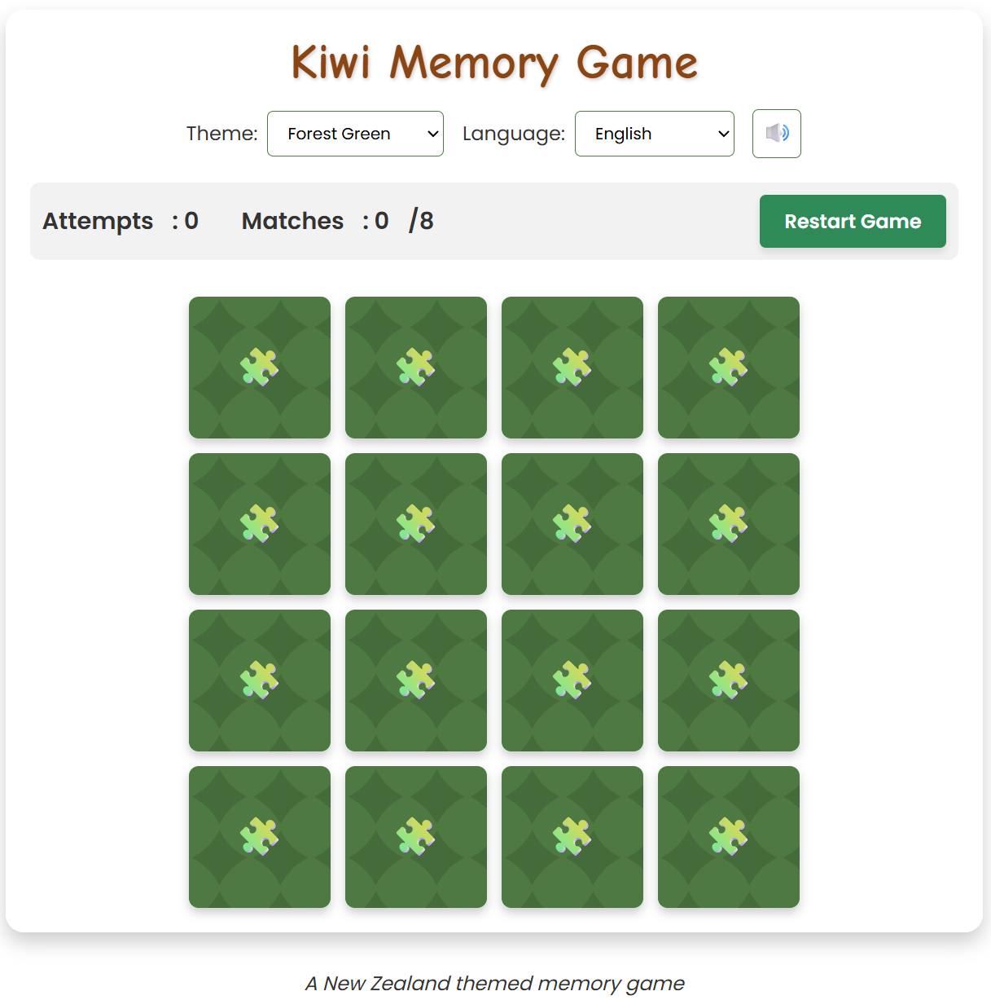
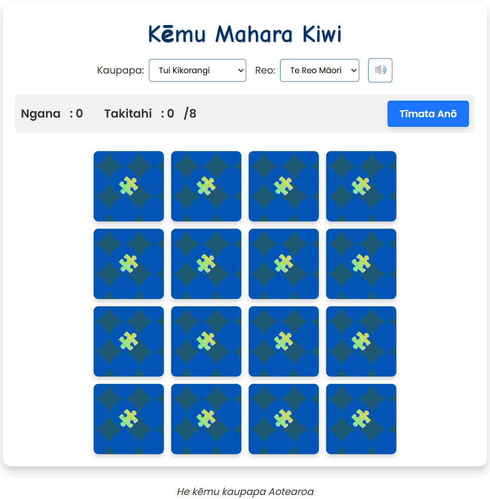

# Kiwi Memory Game

A fun, browser-based memory matching game themed around New Zealand icons and wildlife. Created with help from Amazon Q Developer CLI and built entirely with HTML, CSS, and JavaScript — no frameworks, servers, or dependencies required.

---

## 🌟 Features

* 🧩 4x4 card grid with 8 unique NZ-themed pairs
* 🌀 Koru, 🥝 Kiwi, 🌿 Silver Fern, and more
* 🔄 Flip animations and match logic
* 🎉 Confetti and “Ka pai!” win message
* 🎵 Built-in sound effects (generated with Web Audio API)
* 🖼️ Color theme selector (Forest, Tui, Sunset)
* 🌐 Language toggle: English / Te Reo Māori
* 🛡️ GitHub Pages–ready

---

## 🚀 Getting Started

1. Clone the repo:

   ```sh
   git clone https://github.com/jajera/kiwi-memory-game.git
   ```

2. Open `index.html` in your browser
3. Play immediately — no server or setup required (<https://jajera.github.io/q-kiwi-memory-game/>)

---

## 🌍 GitHub Pages Deployment

This game works perfectly on GitHub Pages:

1. Push this project to GitHub
2. Go to **Settings > Pages**
3. Set the source to `main` branch and root directory `/`
4. Visit the game at <https://jajera.github.io/q-kiwi-memory-game/>

---

## 📚 Documentation

* [Using Q CLI](docs/using-q-cli.md)
* [Game Specification Prompt](docs/kiwi-game-spec.md)

---

## 📸 Screenshots





---

## 🤝 Credits

* Generated using Amazon Q Developer CLI
* Themed around Aotearoa / New Zealand icons

---

## 📄 License

This project is licensed under the MIT License. See the [LICENSE](LICENSE) file for details.
